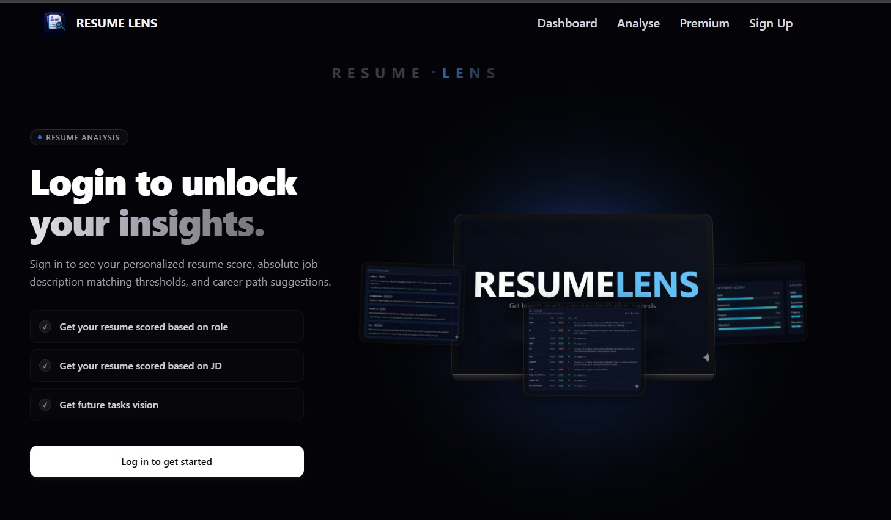
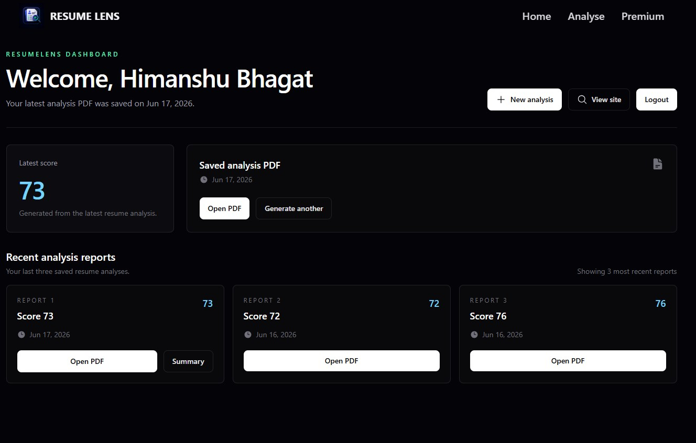
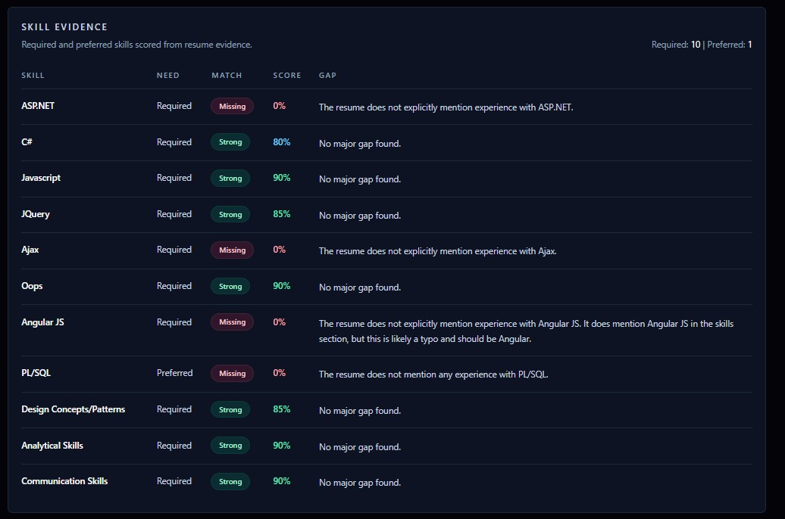
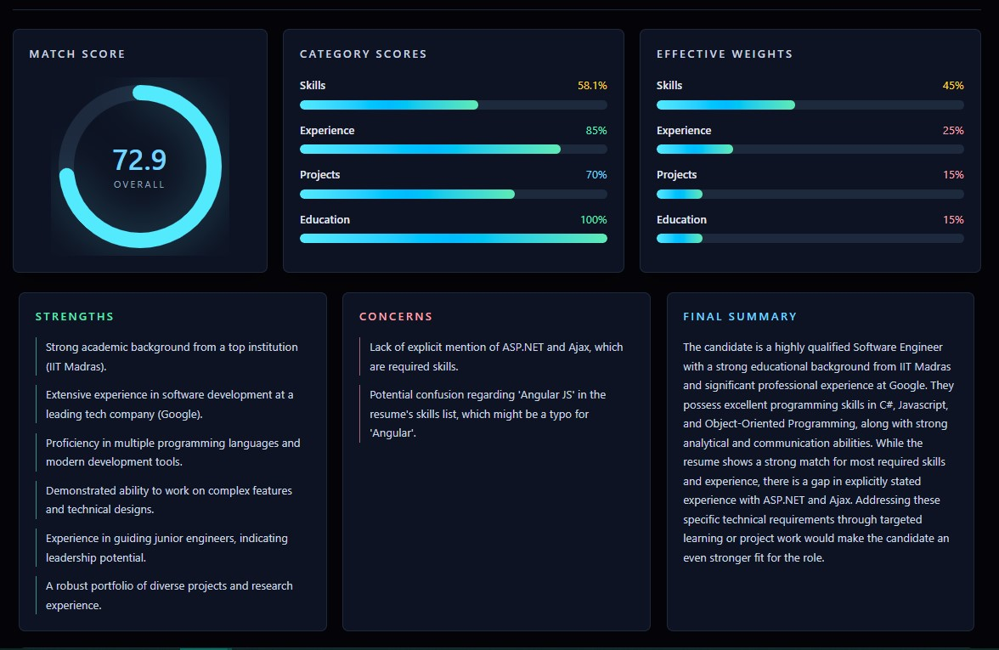
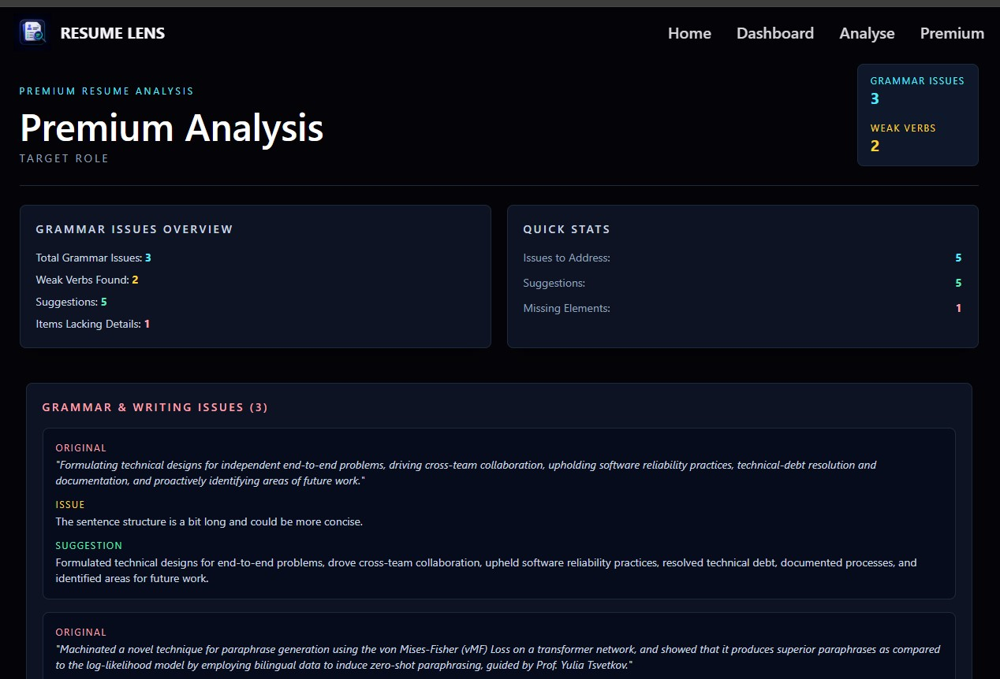
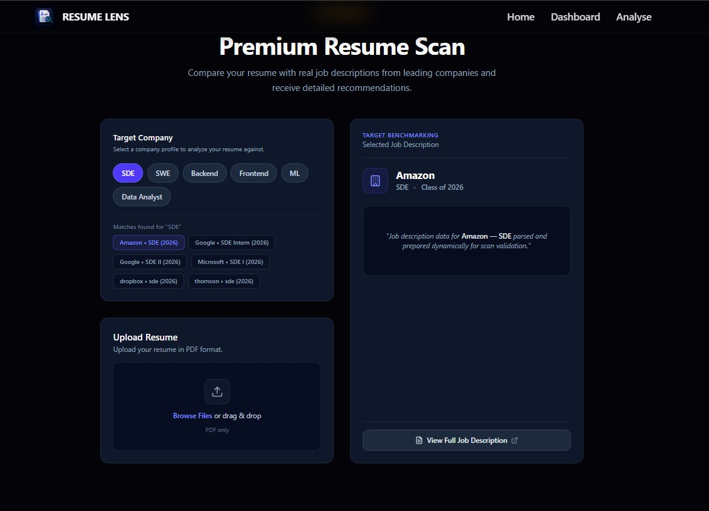
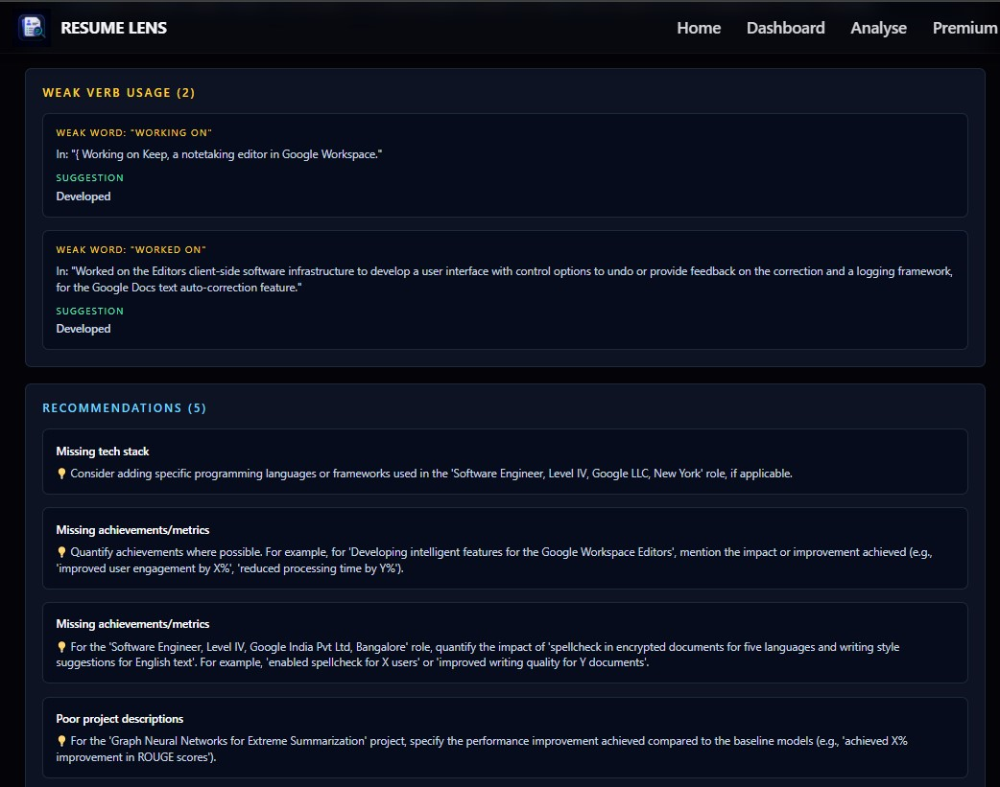
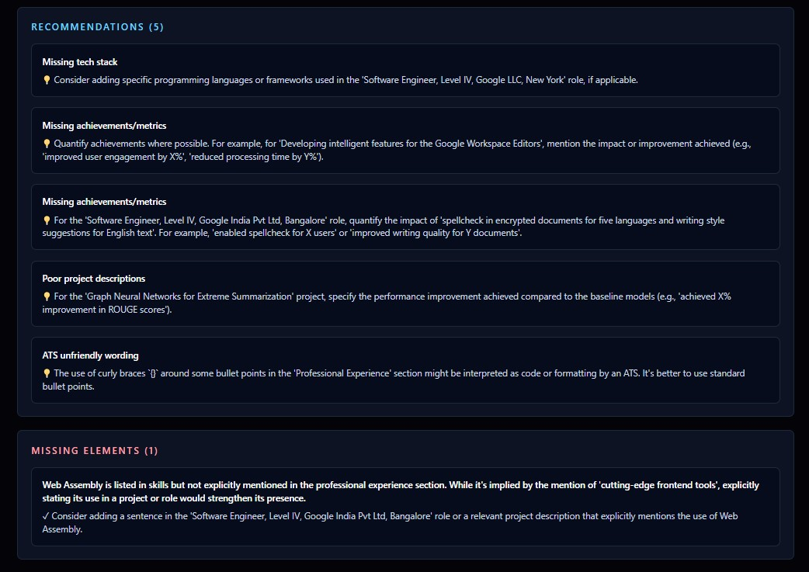

# ResumeLens - AI Resume Analysis Platform

AI-powered resume analysis platform that evaluates resumes against job descriptions and generates personalized reports with strengths, weaknesses, skill gaps, and actionable recommendations.

---

## 🚀 Live Demo

**Website:** [https://resume-analyzer-sp89.onrender.com/]

**Video Demo:** [coming soon...]

---

## ✨ Features

- Upload resumes in PDF format.
- Compare resumes against predefined company/job descriptions.
- AI-powered resume scoring and evaluation.
- Detect:
  - Missing skills
  - Skill gaps
  - Weaknesses
  - Strengths
  
- Generate detailed PDF reports.
- Personalized recommendations to improve resume quality.
- Resume history dashboard.
- Secure authentication and user management.
- Premium feature architecture.
- Responsive UI for desktop and mobile.

---

## 🛠 Tech Stack

### Frontend

- Next.js 15
- React
- TypeScript
- Tailwind CSS
- Better Auth

### Backend

- FastAPI
- Python

### Database

- PostgreSQL
- Supabase

### AI & Processing

- Gemini API
- PDF Text Extraction
- Prompt Engineering

### Caching & Security

- Redis
- Rate Limiting

### Deployment

- Vercel
- Railway / Render (if applicable)

---

# 🏗 Architecture

```text
User
   │
   ▼
Next.js Frontend
   │
   ├── Better Auth
   │
   ├── Upload Resume
   │
   ▼

FastAPI Service
   │
   ├── PDF Extraction
   ├── Resume Parsing
   ├── Prompt Construction
   ├── Gemini API Integration
   └── PDF Report Generation

   │
   ▼

PostgreSQL + Supabase

   │

Redis
   └── Rate Limiting
```

---

# 📌 Problem Statement

Most resume analyzers provide only a simple ATS score or generic feedback.

Candidates preparing for top companies need more than a number—they need:

- Skill gap analysis
- Job-specific recommendations
- Strength and weakness identification
- Actionable suggestions
- Detailed reports

ResumeLens was built to provide an AI-powered, role-aware resume evaluation system that gives honest and practical feedback.

---

# ⚡ How It Works

1. User selects a target role or company.

2. User uploads a resume in PDF format.

3. FastAPI extracts text from the resume.

4. Resume content and target job description are sent to Gemini API.

5. Gemini analyzes:

   - Skills
   - Resume compatibility
   - Missing keywords
   - Strengths
   - Weaknesses
   - Recommendations

6. Structured output is generated.

7. PDF report is created and stored.

8. User can revisit reports from dashboard.

---

# 📸 Screenshots

## 🚀 Landing Page

<p align="center">
  
</p>

<p align="center">
  <i>Modern AI-powered landing page with resume upload and analysis capabilities.</i>
</p>

---

## 📊 Dashboard

<p align="center">
  
</p>

<p align="center">
  <i>Track resume analyses, scores and premium insights from a unified dashboard.</i>
</p>

---

## 📑 Basic Resume Analysis

<table>
<tr>

<td width="50%" align="center">

### Analysis Report



</td>

<td width="50%" align="center">

### Score (Based on skills projects experience etc.)



</td>

</tr>
</table>

<p align="center">
  <i>Receive detailed feedback on compatibility, strengths, weaknesses and personalized recommendations.</i>
</p>

---

## ⭐ Premium Analysis

<table>

<tr>

<td width="50%" align="center">

### Premium Analysis



</td>

<td width="50%" align="center">

### Company Specific Insights



</td>

</tr>

<tr>

<td width="50%" align="center">

### Advanced Recommendations



</td>

<td width="50%" align="center">

### Skill Gap Analysis



</td>

</tr>

</table>

<p align="center">
  <i>Unlock company-specific analysis, advanced Resume insights, skill gap detection and AI-powered recommendations.</i>
</p>

---

## 💎 Premium Benefits

<p align="center">
  
</p>

<p align="center">
  <i>Compare free and premium plans with advanced AI resume optimization features.</i>
</p>

# 🔐 Authentication

Authentication is implemented using **Better Auth**.

Features:

- Email and password authentication
- Session management
- Protected routes
- User-specific resume history
- Secure API access

---

# 🚦 Rate Limiting

To prevent abuse of AI resources:

- Redis-based rate limiting
- Maximum 4 analyses per 24 hours for free users
- Separate premium plan architecture

---

# 📂 Folder Structure

```text
resume-lens

frontend/
├── app
├── components
├── hooks
├── lib
├── services
├── types
└── utils

backend/
├── api
├── services
├── prompts
├── report_generator
├── parsers
└── models
```

---

# 🧠 Challenges Faced

## 1. Reliable Resume Parsing

PDF files have inconsistent structures and layouts.

### Solution

Built a dedicated FastAPI service for PDF extraction and preprocessing before sending data to Gemini.

---

## 2. Structured AI Output

LLMs sometimes generate inconsistent responses.

### Solution

Designed structured prompts and output schemas to ensure:

- Consistent scoring
- Reliable recommendations
- Predictable report generation

---

## 3. Preventing API Abuse

AI APIs are expensive and vulnerable to abuse.

### Solution

Implemented Redis-based rate limiting to restrict free users to 4 analyses every 24 hours.

---

## 4. Separation of Concerns

Initially, all logic was in the frontend.

### Solution

Refactored into a decoupled architecture:

- Next.js handles UI and authentication.
- FastAPI handles AI orchestration and report generation.
- PostgreSQL stores user and analysis history.

This improved maintainability and scalability.

---

# 🔮 Future Improvements

- Resume tailoring for specific companies.
- Support for multiple resume templates.
- Real-time AI chat for resume improvements.
- Cover letter generation.
- Premium subscriptions.
- Multi-language resume support.
- Vector database for semantic resume matching.

---

# 👨‍💻 Author

This project was fully designed and developed by me.

Responsibilities:

- Product design
- UI/UX design
- Frontend development using Next.js
- Backend development using FastAPI
- Gemini API integration
- Database design
- Authentication
- Redis rate limiting
- PDF report generation
- Deployment

---

# 📜 License

MIT License
